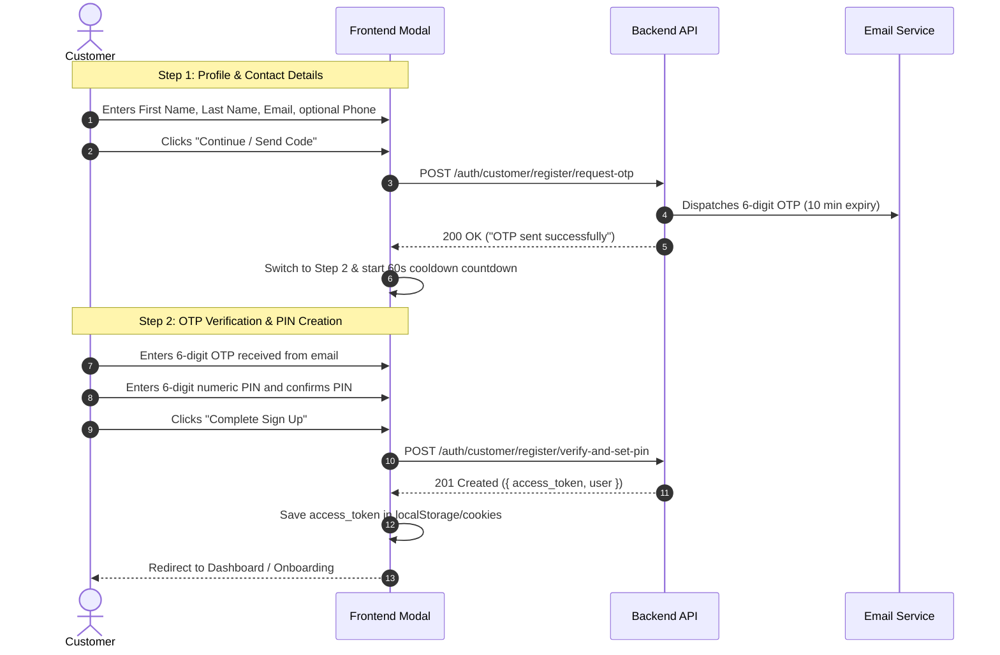

# Frontend Integration Guide: Customer OTP & 6-Digit PIN Authentication Flow

This guide provides the complete, authoritative specification for frontend engineers implementing the customer signup, login, PIN creation, and PIN reset workflows in VemTap.

---

## 1. Architecture & Core Rules

1. **6-Digit Numeric PIN as Password**:
   - Customers do **not** use alphanumeric passwords or auto-generated temporary strings.
   - Customer credentials consist of their **email** (or phone) and a **6-digit numeric PIN** (`/^\d{6}$/`, e.g. `123456`).
   - The PIN is securely hashed with bcrypt on the backend and stored in the customer's password field.
2. **Two-Step OTP-First Registration**:
   - **Step 1 (Contact Details)**: The customer inputs `firstName`, `lastName`, `email`, and optional `phone`. The backend generates and emails a 6-digit verification code (OTP).
   - **Step 2 (Verification & PIN Setup)**: The customer enters the 6-digit OTP received in their email along with their desired 6-digit PIN. Only upon successful OTP verification is the account created/activated and the PIN set.
3. **10-Minute OTP Expiration & Resend Cooldown**:
   - All OTPs expire strictly in **10 minutes**.
   - The frontend should implement a **60-second cooldown timer** before allowing the user to click "Resend Code".
4. **Unverified Customer Login Interception**:
   - When an unverified customer attempts to log in via `/api/v1/auth/login`, the backend intercepts the login, generates and emails a fresh 10-minute OTP, and responds with `{ requiresPinSetup: true, email: ... }`.
   - The frontend must check for `requiresPinSetup: true` and automatically display Step 2 (OTP verification & PIN setup) with the email pre-populated.
5. **PIN Reset (Forgot PIN)**:
   - If a customer forgets their 6-digit PIN, they request a reset OTP via email, and submit their new 6-digit PIN along with the OTP.

---

## 2. API Endpoints Specification

Base URL: `${NEXT_PUBLIC_API_URL}/auth` (e.g. `https://testapi.vemtap.com/api/v1/auth`)

```
┌────────────────────────────────────────────────────────────┬────────┬─────────────────────────────┐
│ Action                                                     │ Method │ Endpoint                    │
├────────────────────────────────────────────────────────────┼────────┼─────────────────────────────┤
│ 1. Request Registration OTP                                │ POST   │ /customer/register/request-otp │
│ 2. Resend OTP                                              │ POST   │ /customer/otp/resend        │
│ 3. Verify OTP & Set 6-Digit PIN (Completes Registration)   │ POST   │ /customer/register/verify-and-set-pin │
│ 4. Customer Login (Intercepts unverified accounts)        │ POST   │ /login                      │
│ 5. Request PIN Reset OTP (Forgot PIN)                      │ POST   │ /customer/pin/forgot        │
│ 6. Submit New 6-Digit PIN with OTP                         │ POST   │ /customer/pin/reset         │
└────────────────────────────────────────────────────────────┴────────┴─────────────────────────────┘
```

---

### 2.1 Request Customer Signup OTP
Dispatches a 6-digit verification code to the customer's email.

- **Endpoint**: `POST /api/v1/auth/customer/register/request-otp`
- **Auth**: Public
- **Headers**: `Content-Type: application/json`
- **Request Body**:
  ```json
  {
    "firstName": "Jane",
    "lastName": "Doe",
    "email": "jane@example.com",
    "phone": "+2348012345678",        // optional, E.164 format
    "branchId": "d290f1ee-..."        // optional, UUID v4 for branch attribution
  }
  ```
- **Success Response (`200 OK`)**:
  ```json
  {
    "message": "OTP sent successfully to your email"
  }
  ```
- **Error Responses**:
  - `400 Bad Request`: Validation failure (e.g. invalid email format, missing `firstName`/`lastName`).
  - `409 Conflict`: Account already exists with this email or phone:
    ```json
    {
      "statusCode": 409,
      "message": "User with this email already exists"
    }
    ```

---

### 2.2 Resend Customer OTP
Dispatches a fresh 10-minute OTP code if the previous code expired or was not received.

- **Endpoint**: `POST /api/v1/auth/customer/otp/resend`
- **Auth**: Public
- **Request Body**:
  ```json
  {
    "email": "jane@example.com"
  }
  ```
- **Success Response (`200 OK`)**:
  ```json
  {
    "message": "A new OTP has been sent to your email"
  }
  ```

---

### 2.3 Verify OTP & Set 6-Digit PIN (Completes Signup)
Verifies the OTP, hashes the 6-digit PIN as the customer password, sets `emailVerified: true` and `status: ACTIVE`, and returns an authenticated JWT session.

- **Endpoint**: `POST /api/v1/auth/customer/register/verify-and-set-pin`
- **Auth**: Public
- **Request Body**:
  ```json
  {
    "email": "jane@example.com",
    "otp": "123456",            // 6-digit code from email (backend also accepts "code")
    "pin": "654321",            // exactly 6 numeric digits: /^\d{6}$/
    "firstName": "Jane",        // optional if provided in Step 1
    "lastName": "Doe",          // optional if provided in Step 1
    "phone": "+2348012345678",  // optional
    "branchId": "d290f1ee-..."  // optional
  }
  ```
- **Success Response (`201 Created`)**:
  ```json
  {
    "access_token": "eyJhbGciOi...",
    "user": {
      "id": "c7a8...",
      "email": "jane@example.com",
      "firstName": "Jane",
      "lastName": "Doe",
      "role": "Customer",
      "status": "Active",
      "emailVerified": true
    },
    "isNewUser": true
  }
  ```
- **Error Responses**:
  - `400 Bad Request`:
    - `"Invalid OTP code"`
    - `"OTP has expired. Please request a new code."`
    - `"PIN must be exactly 6 digits"`
    - `"Verification session not found"`

---

### 2.4 Login with PIN & Unverified Customer Interception
Customers log in using their email (or phone) and their 6-digit PIN as the `password`.

- **Endpoint**: `POST /api/v1/auth/login`
- **Auth**: Public
- **Request Body**:
  ```json
  {
    "identifier": "jane@example.com", // email or phone
    "password": "654321"              // the 6-digit PIN
  }
  ```

#### Standard Success Response (`200 OK`):
```json
{
  "access_token": "eyJhbGciOi...",
  "user": {
    "id": "c7a8...",
    "email": "jane@example.com",
    "role": "Customer",
    "status": "Active"
  }
}
```

#### Unverified Customer Interception (`200 OK` with `requiresPinSetup: true`):
If the customer has not completed OTP verification or set their PIN, the backend intercepts the login, generates and emails a fresh 10-minute OTP, and returns:
```json
{
  "requiresPinSetup": true,
  "email": "jane@example.com",
  "message": "Please verify your email and set your 6-digit PIN to proceed."
}
```
> **Frontend Implementation Requirement**:
> When receiving `response.data.requiresPinSetup === true`, do NOT treat this as a standard login. Instead, open the Step 2 modal (OTP verification + 6-digit PIN setup) prefilled with the customer's email.

---

### 2.5 Request PIN Reset (Forgot PIN)
Dispatches a 10-minute reset OTP code to the customer's email.

- **Endpoint**: `POST /api/v1/auth/customer/pin/forgot`
- **Auth**: Public
- **Request Body**:
  ```json
  {
    "email": "jane@example.com"
  }
  ```
- **Success Response (`200 OK`)**:
  ```json
  {
    "message": "If an account exists with this email, a reset OTP has been sent."
  }
  ```

---

### 2.6 Reset 6-Digit PIN
Verifies the reset OTP and updates the customer's 6-digit PIN.

- **Endpoint**: `POST /api/v1/auth/customer/pin/reset`
- **Auth**: Public
- **Request Body**:
  ```json
  {
    "email": "jane@example.com",
    "otp": "123456",            // 6-digit code received via email
    "newPin": "987654"          // new 6-digit PIN (backend also accepts "pin")
  }
  ```
- **Success Response (`200 OK`)**:
  ```json
  {
    "message": "PIN reset successfully. You can now log in with your new PIN."
  }
  ```
- **Error Responses**:
  - `400 Bad Request`: `"Invalid or expired reset OTP"`, `"New PIN must be exactly 6 digits"`.

---

## 3. Frontend Implementation Reference

### 3.1 TypeScript Service Client (`customerAuth.ts`)

```typescript
import axios from 'axios';

const API_URL = process.env.NEXT_PUBLIC_API_URL || 'https://testapi.vemtap.com/api/v1';

export interface CustomerSignupStep1Dto {
  firstName: string;
  lastName: string;
  email: string;
  phone?: string;
  branchId?: string;
}

export interface VerifyAndSetPinDto {
  email: string;
  otp: string;
  pin: string;
  firstName?: string;
  lastName?: string;
  phone?: string;
  branchId?: string;
}

export interface ResetPinDto {
  email: string;
  otp: string;
  newPin: string;
}

export const customerAuthApi = {
  // Step 1: Send registration OTP
  requestSignupOtp: async (data: CustomerSignupStep1Dto) => {
    const res = await axios.post(`${API_URL}/auth/customer/register/request-otp`, data);
    return res.data;
  },

  // Resend OTP
  resendOtp: async (email: string) => {
    const res = await axios.post(`${API_URL}/auth/customer/otp/resend`, { email });
    return res.data;
  },

  // Step 2: Verify OTP and Set 6-Digit PIN
  verifyAndSetPin: async (data: VerifyAndSetPinDto) => {
    const res = await axios.post(`${API_URL}/auth/customer/register/verify-and-set-pin`, data);
    return res.data;
  },

  // Customer Login (handles PIN & unverified interception)
  login: async (identifier: string, pin: string) => {
    const res = await axios.post(`${API_URL}/auth/login`, {
      identifier,
      password: pin,
    });
    return res.data;
  },

  // Request PIN Reset (Forgot PIN)
  requestPinReset: async (email: string) => {
    const res = await axios.post(`${API_URL}/auth/customer/pin/forgot`, { email });
    return res.data;
  },

  // Submit New PIN
  resetPin: async (data: ResetPinDto) => {
    const res = await axios.post(`${API_URL}/auth/customer/pin/reset`, data);
    return res.data;
  },
};
```

---

### 3.2 Sequence Diagram: 2-Step Registration Flow



---

### 3.3 Handling Login Interception in Frontend

In your `login` handler component:

```typescript
const handleCustomerLogin = async (identifier: string, pin: string) => {
  try {
    const response = await customerAuthApi.login(identifier, pin);

    // 1. Check if user is unverified and requires PIN setup
    if (response.requiresPinSetup) {
      toast.info(response.message || 'Please verify your email and set your 6-digit PIN.');
      // Transition UI to Step 2 with email pre-filled
      setAuthModalState({
        isOpen: true,
        step: 2,
        email: response.email,
      });
      return;
    }

    // 2. Normal successful login
    localStorage.setItem('accessToken', response.access_token);
    router.push('/dashboard');
  } catch (error: any) {
    toast.error(error.response?.data?.message || 'Invalid credentials');
  }
};
```

---

### 3.4 UI Input Validation Rules Checklist

| Field Name | Type | Validation Constraint | User-Facing Validation Error |
| :--- | :--- | :--- | :--- |
| `firstName` | String | Trimmed, non-empty, $\ge$ 2 chars | *"Please enter your first name."* |
| `lastName` | String | Trimmed, non-empty, $\ge$ 2 chars | *"Please enter your last name."* |
| `email` | String | Valid email address (`/^[^\s@]+@[^\s@]+\.[^\s@]+$/`) | *"Please enter a valid email address."* |
| `phone` | String | Optional, E.164 (`/^\+?[1-9]\d{7,14}$/`) | *"Please enter a valid phone number."* |
| `otp` | String | Exactly 6 numeric digits (`/^\d{6}$/`) | *"Please enter the 6-digit code sent to your email."* |
| `pin` | String | Exactly 6 numeric digits (`/^\d{6}$/`) | *"PIN must be exactly 6 numeric digits."* |
| `confirmPin`| String | Must match `pin` | *"PINs do not match."* |

---

### 3.5 Resend Button 60-Second Cooldown Pattern

```typescript
import { useState, useEffect } from 'react';

export function useResendCooldown(initialSeconds = 60) {
  const [countdown, setCountdown] = useState(0);

  const startCooldown = () => setCountdown(initialSeconds);

  useEffect(() => {
    if (countdown <= 0) return;
    const timer = setInterval(() => {
      setCountdown((prev) => prev - 1);
    }, 1000);
    return () => clearInterval(timer);
  }, [countdown]);

  return {
    canResend: countdown === 0,
    countdown,
    startCooldown,
  };
}
```
