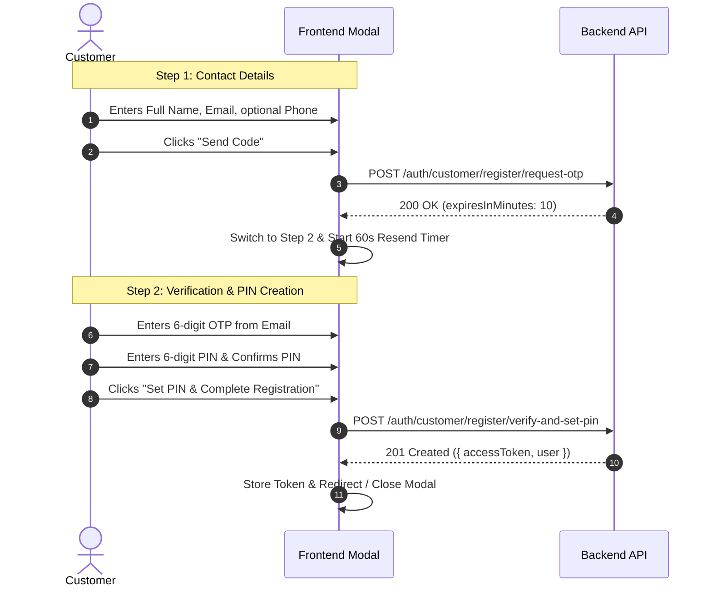

# Frontend Integration Guide: Customer OTP & 6-Digit PIN Authentication Flow

This document details the backend authentication contract and step-by-step frontend implementation guide for the customer registration, login interception, PIN management, and PIN reset features.

---

## 1. Overview & Key Principles

1. **Numeric 6-Digit PIN as Password**:
   - Customers do **not** use traditional passwords or auto-generated passwords.
   - The password is a strict **6-digit numeric PIN** (e.g. `123456`, matching `/^\d{6}$/`).
2. **OTP-First Registration**:
   - The customer **cannot** set a PIN upfront during the first screen.
   - They must first submit their contact details (`fullName`, `email`, and optional `phone`) to receive a 6-digit verification code.
   - The 6-digit PIN can only be submitted alongside a valid OTP code.
3. **10-Minute OTP Expiration & Resend**:
   - All OTPs strictly expire in **10 minutes** (`expiresInMinutes: 10`).
   - Customers can request a new OTP at any time if their code expired or was lost.
4. **Unverified Customer Login Interception**:
   - If an unverified customer attempts to log in via `/api/v1/auth/login`, the backend intercepts the login, generates and sends a fresh 10-minute OTP to their email, and returns `{ requiresPinSetup: true, email: ... }`.
   - The frontend should detect `requiresPinSetup` and immediately present the OTP & PIN setup screen.
5. **Forgot PIN / Reset PIN**:
   - Customers can reset a forgotten PIN using an email OTP.

---

## 2. API Endpoints Reference

Base URL prefix: `/api/v1/auth`

### 2.1 Request Customer Signup OTP
Dispatches a 6-digit verification code to the customer's email address.

- **Method**: `POST`
- **Path**: `/api/v1/auth/customer/register/request-otp`
- **Access**: Public
- **Request Body (`RequestCustomerSignupOtpDto`)**:
  ```json
  {
    "fullName": "Jane Doe",
    "email": "jane@example.com",
    "phone": "+2348012345678" // optional, E.164 format
  }
  ```
- **Responses**:
  - `200 OK`:
    ```json
    {
      "message": "Verification OTP sent to your email",
      "email": "jane@example.com",
      "expiresInMinutes": 10
    }
    ```
  - `409 Conflict`: If an active account already exists with this email or phone:
    ```json
    {
      "statusCode": 409,
      "message": "A customer account with this email already exists. Please log in."
    }
    ```

---

### 2.2 Resend Customer OTP
Dispatches a fresh 10-minute OTP code if the previous code expired or was not received.

- **Method**: `POST`
- **Path**: `/api/v1/auth/customer/otp/resend`
- **Access**: Public
- **Request Body (`ResendCustomerOtpDto`)**:
  ```json
  {
    "email": "jane@example.com"
  }
  ```
- **Responses**:
  - `200 OK`:
    ```json
    {
      "message": "A fresh verification OTP has been sent to your email",
      "email": "jane@example.com",
      "expiresInMinutes": 10
    }
    ```
  - `404 Not Found`: If no pending customer record was found for this email.

---

### 2.3 Verify OTP & Set 6-Digit PIN (Completes Signup)
Verifies the OTP code, securely hashes the 6-digit PIN, activates the customer account (`emailVerified: true`, `status: ACTIVE`), and returns an authentication JWT session.

- **Method**: `POST`
- **Path**: `/api/v1/auth/customer/register/verify-and-set-pin`
- **Access**: Public
- **Request Body (`VerifyAndSetCustomerPinDto`)**:
  ```json
  {
    "email": "jane@example.com",
    "otp": "123456",            // exactly 6 digits: /^\d{6}$/
    "pin": "654321",            // exactly 6 digits: /^\d{6}$/
    "fullName": "Jane Doe",     // optional if already provided in Step 1
    "phone": "+2348012345678"   // optional
  }
  ```
- **Responses**:
  - `201 Created`:
    ```json
    {
      "accessToken": "eyJhbGciOi...",
      "user": {
        "id": "uuid",
        "email": "jane@example.com",
        "role": "Customer",
        "status": "Active",
        "emailVerified": true
      }
    }
    ```
  - `400 Bad Request`:
    - `"Invalid verification code"` (code does not match)
    - `"Verification code has expired. Please request a new one."` (expired after 10 mins)
    - `"PIN must be exactly 6 digits"` (if non-numeric or wrong length)

---

### 2.4 Login with PIN & Unverified Customer Interception
Customers log in via the standard `/auth/login` endpoint using their email (or phone) and their 6-digit PIN as the `password`.

- **Method**: `POST`
- **Path**: `/api/v1/auth/login`
- **Access**: Public
- **Request Body**:
  ```json
  {
    "emailOrPhone": "jane@example.com",
    "password": "654321" // The customer's 6-digit PIN
  }
  ```

#### Standard Successful Login Response (`200 OK`):
```json
{
  "accessToken": "eyJhbGciOi...",
  "user": {
    "id": "uuid",
    "email": "jane@example.com",
    "role": "Customer",
    "status": "Active"
  }
}
```

#### Unverified Customer Interception Response (`200 OK`):
When a customer account has not yet completed OTP verification or set a PIN, the backend intercepts the login, sends a fresh 10-minute OTP to their email, and returns:
```json
{
  "requiresPinSetup": true,
  "email": "jane@example.com",
  "message": "Please verify your email and set your 6-digit PIN to proceed."
}
```
> **Frontend Action**: Check `if (response.data.requiresPinSetup)`. If true, transition the user to the OTP & PIN setup modal with the email pre-populated.

---

### 2.5 Request PIN Reset (Forgot PIN)
Generates and emails a 10-minute reset OTP code.

- **Method**: `POST`
- **Path**: `/api/v1/auth/customer/pin/forgot`
- **Access**: Public
- **Request Body (`RequestCustomerPinResetDto`)**:
  ```json
  {
    "email": "jane@example.com"
  }
  ```
- **Responses**:
  - `200 OK`:
    ```json
    {
      "message": "If this email is associated with a customer account, a PIN reset code has been sent."
    }
    ```

---

### 2.6 Reset 6-Digit PIN
Verifies the reset OTP and updates the customer's PIN.

- **Method**: `POST`
- **Path**: `/api/v1/auth/customer/pin/reset`
- **Access**: Public
- **Request Body (`ResetCustomerPinDto`)**:
  ```json
  {
    "email": "jane@example.com",
    "otp": "123456", // 6 digits
    "pin": "987654"  // New 6 digits PIN
  }
  ```
- **Responses**:
  - `200 OK`:
    ```json
    {
      "message": "Your 6-digit PIN has been successfully reset. You can now log in."
    }
    ```
  - `400 Bad Request`:
    - `"Invalid verification code"`
    - `"Verification code has expired. Please request a new one."`
    - `"PIN must be exactly 6 digits"`

---

## 3. Recommended Frontend Integration Architecture

### 3.1 TypeScript API Client (`visitorAuth.ts` or `customerAuth.ts`)

```typescript
import axios from 'axios';

const API_BASE = process.env.NEXT_PUBLIC_API_URL || 'http://localhost:3001/api/v1';

export interface CustomerSignupStep1Payload {
  fullName: string;
  email: string;
  phone?: string;
}

export interface VerifyAndSetPinPayload {
  email: string;
  otp: string;
  pin: string;
  fullName?: string;
  phone?: string;
}

export interface ResetPinPayload {
  email: string;
  otp: string;
  pin: string;
}

export const customerAuthApi = {
  // 1. Step 1: Send OTP to email
  requestSignupOtp: async (data: CustomerSignupStep1Payload) => {
    const res = await axios.post(`${API_BASE}/auth/customer/register/request-otp`, data);
    return res.data;
  },

  // 2. Resend OTP
  resendOtp: async (email: string) => {
    const res = await axios.post(`${API_BASE}/auth/customer/otp/resend`, { email });
    return res.data;
  },

  // 3. Step 2: Verify OTP and Set 6-Digit PIN (Returns Auth Session)
  verifyAndSetPin: async (data: VerifyAndSetPinPayload) => {
    const res = await axios.post(`${API_BASE}/auth/customer/register/verify-and-set-pin`, data);
    return res.data;
  },

  // 4. Request PIN Reset (Forgot PIN)
  requestPinReset: async (email: string) => {
    const res = await axios.post(`${API_BASE}/auth/customer/pin/forgot`, { email });
    return res.data;
  },

  // 5. Submit New PIN with OTP
  resetPin: async (data: ResetPinPayload) => {
    const res = await axios.post(`${API_BASE}/auth/customer/pin/reset`, data);
    return res.data;
  },

  // 6. Login
  login: async (emailOrPhone: string, pin: string) => {
    const res = await axios.post(`${API_BASE}/auth/login`, {
      emailOrPhone,
      password: pin,
    });
    return res.data;
  },
};
```

---

### 3.2 Registration Modal UX Flow (2-Step Pattern)



---

### 3.3 UI Validation Rules Checklist

| Field | Type | Validation Rule | Error Message Prompt |
| :--- | :--- | :--- | :--- |
| `fullName` | String | Trimmed, $\ge$ 2 characters | "Please enter your full name." |
| `email` | String | Valid email address | "Please enter a valid email address." |
| `phone` | String | Optional, E.164 (`/^\+?[1-9]\d{7,14}$/`) | "Please enter a valid phone number." |
| `otp` | String | Exactly 6 numeric digits (`/^\d{6}$/`) | "Please enter the 6-digit code sent to your email." |
| `pin` | String | Exactly 6 numeric digits (`/^\d{6}$/`) | "PIN must be exactly 6 digits." |
| `confirmPin` | String | Must equal `pin` | "PINs do not match." |

---

### 3.4 Handling Login Redirection for Unverified Users

In your login handler (e.g. `LoginForm.tsx` or `loginVisitor`):

```typescript
const handleLogin = async (emailOrPhone: string, pin: string) => {
  try {
    const response = await customerAuthApi.login(emailOrPhone, pin);

    // Check for interception response
    if (response.requiresPinSetup) {
      toast.info(response.message || 'Please verify your email and set your 6-digit PIN.');
      // Open OTP & PIN setup modal
      setModalState({
        step: 2,
        email: response.email,
        isOpen: true,
      });
      return;
    }

    // Normal login flow
    localStorage.setItem('accessToken', response.accessToken);
    router.push('/dashboard');
  } catch (error: any) {
    toast.error(error?.response?.data?.message || 'Invalid credentials');
  }
};
```

---

### 3.5 Resend Timer Best Practice
To prevent abuse and provide great UX:
1. When entering Step 2, initialize a 60-second countdown (`resendCooldown = 60`).
2. Disable the "Resend Code" button while `resendCooldown > 0`.
3. Display: `"Resend in 0:45"` until cooldown reaches 0.
4. When clicked, invoke `customerAuthApi.resendOtp(email)` and reset the timer back to 60 seconds.
