# VemTap POS & Inventory Management System — Business Dashboard

Complete implementation of the POS & Inventory system within the existing `/dashboard` route. This is the **core commerce engine** of VemTap — the feature that turns VemTap from a customer capture platform into a full retail management system.

## Current State

- **POS page** (`/dashboard/pos`) — "Coming Soon" placeholder
- **Inventory page** (`/dashboard/inventory`) — Basic dashboard with stats cards, activity logs, and stock health bar (using mock data)
- **Existing stores** — `usePosStore`, `useInventoryStore`, `useProductStore`, `useCartStore` exist but are minimal scaffolds
- **Existing components** — `CartPanel`, `ProductGrid`, `POSHeader` (basic), `InventoryDashboard` components (basic)
- **Navigation** — Commerce section exists in sidebar with Catalogue, Inventory, POS links
- **Backend** — No POS/Inventory API endpoints exist yet, so we build the full frontend with mock data and Zustand stores, ready for backend integration

## User Review Required

> [!IMPORTANT]
> **Frontend-Only Approach**: Since there are no backend API endpoints for POS/Inventory yet, this entire implementation will be **frontend-only** using Zustand persisted stores with mock/seed data. All stores will be designed with clear interfaces that map directly to future API endpoints. When the backend is ready, we simply swap the Zustand operations for API calls via React Query — zero UI changes needed.

> [!IMPORTANT]
> **Scope Prioritization**: The docs describe ~200 screens across 30 modules. I recommend implementing in **6 sprints** (phases), starting with the core revenue-generating features (POS + Products + Inventory) that deliver immediate value, then layering in management features. Each phase is independently deployable.

> [!WARNING]
> **Design System Consistency**: The existing dashboard uses a very specific design language — `rounded-[32px]` cards, `font-black` typography, `tracking-widest` labels, `#066CF4` primary blue, card-based layouts with subtle borders. All new POS/Inventory screens MUST match this exactly. No generic Bootstrap-looking UI.

## Open Questions

> [!IMPORTANT]
> **1. Phase Scope for This Session** — Do you want me to implement all 6 phases in one go, or should we start with **Phase 1 (POS Core + Products)** and iterate? Phase 1 alone is substantial (~25 screens, ~15 components, 3 stores).

> [!IMPORTANT]
> **2. Mobile Bottom Navigation** — The docs specify a bottom nav with `Dashboard | POS | Products | Inventory | More`. Currently the dashboard uses `DashboardMobileNav.tsx`. Should we add a **POS-specific mobile nav** that swaps in when the user is inside `/dashboard/pos/*` routes, or keep the existing global mobile nav?

> [!IMPORTANT]
> **3. Barcode Scanning** — The docs mention camera-based barcode scanning. Should we integrate a real barcode scanning library (e.g., `@zxing/browser`) or build a mock/simulated scanner for now?

> [!IMPORTANT]
> **4. Currency** — The docs use Nigerian Naira (₦). Should all currency displays default to ₦, or should it be configurable per business from settings?

---

## Architecture Overview

```mermaid
graph TD
    A["/dashboard"] --> B["/dashboard/pos"]
    A --> C["/dashboard/inventory"]
    A --> D["/dashboard/pos/products"]
    
    B --> B1["POS Home - Cashier Screen"]
    B --> B2["/pos/cart"]
    B --> B3["/pos/checkout"]
    B --> B4["/pos/payment"]
    B --> B5["/pos/receipt"]
    B --> B6["/pos/held-sales"]
    
    C --> C1["Inventory Dashboard"]
    C --> C2["/inventory/stock"]
    C --> C3["/inventory/receiving"]
    C --> C4["/inventory/adjustments"]
    C --> C5["/inventory/transfers"]
    C --> C6["/inventory/counting"]
    C --> C7["/inventory/low-stock"]
    
    D --> D1["Products Dashboard"]
    D --> D2["/products/add"]
    D --> D3["/products/[id]"]
    D --> D4["/products/categories"]
    D --> D5["/products/barcodes"]
    
    A --> E["/dashboard/pos/sales"]
    A --> F["/dashboard/pos/returns"]
    A --> G["/dashboard/pos/orders"]
    A --> H["/dashboard/pos/customers"]
    A --> I["/dashboard/pos/suppliers"]
    A --> J["/dashboard/pos/staff"]
    A --> K["/dashboard/pos/registers"]
    A --> L["/dashboard/pos/reports"]
    A --> M["/dashboard/pos/settings"]
```



---

## Proposed Changes

### Phase 1: POS Core + Products (THE MONEY MAKER)
*This is what cashiers use every day. It needs to be fast, beautiful, and bulletproof.*

---

### Store Layer (State Management)

#### [MODIFY] [usePosStore.ts](file:///c:/Users/PC/Desktop/Vemtap/apps/VemTap/store/usePosStore.ts)
Expand the POS store to handle the full sale lifecycle:
- Register management (open/close, cash tracking)
- Held/suspended sales queue
- Payment processing (cash, transfer, card, split)
- Receipt generation with unique receipt numbers
- Sale completion with inventory auto-deduction
- Discount management (percentage + fixed)
- Customer attachment to sales
- Transaction history

#### [MODIFY] [useProductStore.ts](file:///c:/Users/PC/Desktop/Vemtap/apps/VemTap/store/useProductStore.ts)
Expand product store to support:
- Product CRUD with full fields (name, SKU, barcode, category, brand, cost price, selling price, opening stock, min stock alert, image, description, variants)
- Product categories CRUD
- Product variants (size, color, weight, custom)
- Product status management (active, low stock, out of stock, archived)
- Barcode generation and management
- Product search/filter/sort
- Bulk operations
- Seed data (~20 sample products across categories)

#### [MODIFY] [useInventoryStore.ts](file:///c:/Users/PC/Desktop/Vemtap/apps/VemTap/store/useInventoryStore.ts)
Expand to track:
- Full stock movement history with movement types
- Stock receiving workflow (from supplier)
- Stock adjustments (damaged, lost, expired, internal use)
- Stock transfers (multi-branch)
- Physical stock counting + variance detection
- Low stock center with reorder suggestions
- Inventory valuation

#### [NEW] [useSalesStore.ts](file:///c:/Users/PC/Desktop/Vemtap/apps/VemTap/store/useSalesStore.ts)
New store for completed sales tracking:
- Transaction history with full details
- Sales analytics (daily, weekly, monthly)
- Receipt records
- Payment method tracking

#### [NEW] [useRegisterStore.ts](file:///c:/Users/PC/Desktop/Vemtap/apps/VemTap/store/useRegisterStore.ts)
Cash register management:
- Register sessions (open/close)
- Cash reconciliation
- Expected vs actual cash tracking
- Register history

#### [NEW] [useReturnStore.ts](file:///c:/Users/PC/Desktop/Vemtap/apps/VemTap/store/useReturnStore.ts)
Returns and refunds:
- Return request workflow
- Refund processing (full, partial, store credit, exchange)
- Inventory reversal on returns
- Return/refund history

#### [NEW] [useOrderStore.ts](file:///c:/Users/PC/Desktop/Vemtap/apps/VemTap/store/useOrderStore.ts)
Order management for restaurants/advance orders:
- Order lifecycle (pending → processing → ready → completed)
- Order creation with customer + products
- Order status updates with timeline
- Order cancellation with reasons

#### [NEW] [usePosCustomerStore.ts](file:///c:/Users/PC/Desktop/Vemtap/apps/VemTap/store/usePosCustomerStore.ts)
POS-specific customer management:
- Customer directory with purchase context
- Purchase history per customer
- Customer stats (total spend, visit count, last purchase)
- Customer creation during sale

#### [NEW] [useSupplierStore.ts](file:///c:/Users/PC/Desktop/Vemtap/apps/VemTap/store/useSupplierStore.ts)
Supplier management:
- Supplier directory
- Purchase order tracking
- Delivery history

#### [NEW] [usePosStaffStore.ts](file:///c:/Users/PC/Desktop/Vemtap/apps/VemTap/store/usePosStaffStore.ts)
POS staff management:
- Staff directory with roles
- Activity tracking (sales made, inventory changes)
- Role-based permissions

#### [NEW] [usePosSettingsStore.ts](file:///c:/Users/PC/Desktop/Vemtap/apps/VemTap/store/usePosSettingsStore.ts)
POS & Inventory settings:
- Business info, receipt settings, barcode settings
- Inventory thresholds, tax settings
- POS behavior settings

#### [NEW] [usePosReportsStore.ts](file:///c:/Users/PC/Desktop/Vemtap/apps/VemTap/store/usePosReportsStore.ts)
Reports & Analytics data:
- Computed sales reports (daily, weekly, monthly)
- Inventory reports
- Product performance reports
- Staff reports, customer reports

---

### Route Structure

#### Phase 1 Routes (POS + Products + Inventory Core)

| Route | Screen | Purpose |
|-------|--------|---------|
| `/dashboard/pos` | POS Home | Main cashier screen with product grid, search, categories, cart summary |
| `/dashboard/pos/cart` | Cart | Full cart review with quantities, discounts, customer |
| `/dashboard/pos/checkout` | Checkout | Final review before payment |
| `/dashboard/pos/payment` | Payment | Payment method selection + processing |
| `/dashboard/pos/success` | Sale Complete | Success animation + receipt preview |
| `/dashboard/pos/held` | Held Sales | Suspended transactions list |
| `/dashboard/pos/products` | Products Dashboard | Product overview with stats |
| `/dashboard/pos/products/list` | Products List | Searchable product list |
| `/dashboard/pos/products/add` | Add Product Wizard | Multi-step product creation |
| `/dashboard/pos/products/[id]` | Product Details | View/edit product details |
| `/dashboard/pos/products/categories` | Categories | Category management |
| `/dashboard/pos/products/barcodes` | Barcode Center | Barcode generation + printing |

#### Phase 2 Routes (Inventory Deep)

| Route | Screen | Purpose |
|-------|--------|---------|
| `/dashboard/inventory` | Inventory Dashboard | Enhanced with full stats + quick actions |
| `/dashboard/inventory/stock` | Stock List | All inventory items with status badges |
| `/dashboard/inventory/receiving` | Stock Receiving | Multi-step receiving workflow |
| `/dashboard/inventory/adjustments` | Adjustments | Damaged/lost/expired stock |
| `/dashboard/inventory/transfers` | Transfers | Multi-branch transfers |
| `/dashboard/inventory/counting` | Stock Count | Physical count + variance |
| `/dashboard/inventory/low-stock` | Low Stock Center | Critical + warning items |
| `/dashboard/inventory/history` | Movement History | Full stock movement timeline |

#### Phase 3 Routes (Sales, Returns, Refunds)

| Route | Screen | Purpose |
|-------|--------|---------|
| `/dashboard/pos/sales` | Sales Dashboard | Sales overview + transaction list |
| `/dashboard/pos/sales/[id]` | Transaction Details | Full sale info + receipt |
| `/dashboard/pos/returns` | Returns | Return workflow |
| `/dashboard/pos/refunds` | Refunds | Refund processing |

#### Phase 4 Routes (Orders, Customers, Suppliers)

| Route | Screen | Purpose |
|-------|--------|---------|
| `/dashboard/pos/orders` | Orders Dashboard | Order management |
| `/dashboard/pos/customers` | Customers | POS customer directory |
| `/dashboard/pos/suppliers` | Suppliers | Supplier management |
| `/dashboard/pos/purchases` | Purchases | Purchase order management |

#### Phase 5 Routes (Staff, Registers, Reports)

| Route | Screen | Purpose |
|-------|--------|---------|
| `/dashboard/pos/staff` | Staff | POS staff management |
| `/dashboard/pos/registers` | Registers | Cash register sessions |
| `/dashboard/pos/reports` | Reports | All report types |
| `/dashboard/pos/analytics` | Analytics | Business intelligence |

#### Phase 6 Routes (Settings, Support, Global)

| Route | Screen | Purpose |
|-------|--------|---------|
| `/dashboard/pos/settings` | POS Settings | Business info, receipt, barcode, tax |
| `/dashboard/pos/notifications` | Notifications | Business alerts center |
| `/dashboard/pos/activity` | Activity Logs | Audit trail |
| `/dashboard/pos/support` | Help & Support | Ticket system |

---

### Component Architecture

#### Shared/Reusable Components

##### [NEW] `components/dashboard/pos/shared/`
- **POSPageHeader.tsx** — Consistent page header with back navigation, title, and actions
- **POSStatsCard.tsx** — Animated stat card (reusable across all dashboards)
- **POSEmptyState.tsx** — Beautiful empty states with illustrations + CTA
- **POSSuccessState.tsx** — Success animations (checkmark, confetti)
- **POSSearchBar.tsx** — Search with barcode scan button
- **POSFilterChips.tsx** — Horizontal scrollable filter chips
- **POSBottomSheet.tsx** — Mobile bottom sheet component for modals
- **POSStatusBadge.tsx** — Colored status badges (Healthy, Low Stock, Out of Stock, etc.)
- **POSConfirmDialog.tsx** — Delete/archive confirmation modal
- **POSStepIndicator.tsx** — Multi-step wizard progress indicator
- **POSDataCard.tsx** — Card layout for list items (products, transactions, customers)
- **POSDateFilter.tsx** — Date range picker (Today, Week, Month, Custom)

---

#### Phase 1 Components

##### POS Module — `components/dashboard/pos/`

- **POSHomeScreen.tsx** — Main cashier view with:
  - Register status header
  - Search bar + barcode scan
  - Category filter chips (horizontal scroll)
  - Product grid (tap to add to cart)
  - Sticky bottom cart summary bar
- **POSProductSearch.tsx** — Real-time product search with results
- **POSCategoryGrid.tsx** — Category selection grid
- **POSBarcodeScan.tsx** — Camera-based barcode scanner screen
- **POSQuickSelectGrid.tsx** — Fast-selling products large cards
- **POSCartScreen.tsx** — Full cart with:
  - Product list with quantity controls
  - Subtotal / Discount / Tax / Total
  - Add Customer / Apply Discount / Checkout buttons
- **POSCartItemEdit.tsx** — Edit individual cart item (qty, price, discount)
- **POSApplyDiscount.tsx** — Discount modal (percentage or fixed amount)
- **POSAddCustomerToSale.tsx** — Customer search/add during sale
- **POSCheckoutScreen.tsx** — Final review with products, customer, total
- **POSPaymentMethodSelect.tsx** — Large payment cards (Cash, Transfer, Card, Split)
- **POSCashPayment.tsx** — Cash payment with auto-change calculation
- **POSTransferPayment.tsx** — Bank transfer confirmation
- **POSCardPayment.tsx** — Card payment confirmation
- **POSSplitPayment.tsx** — Split between multiple methods
- **POSPaymentConfirmation.tsx** — Final confirmation before completing
- **POSSaleSuccess.tsx** — Success animation + receipt actions
- **POSReceiptPreview.tsx** — Digital receipt view
- **POSHeldSales.tsx** — Suspended sales list with resume/delete

##### Products Module — `components/dashboard/pos/products/`

- **ProductsDashboard.tsx** — Stats cards + recent products + quick actions
- **ProductsList.tsx** — Searchable, filterable product list with cards
- **ProductDetails.tsx** — Full product info with tabs (Info, Stock, History)
- **AddProductWizard.tsx** — Multi-step creation wizard:
  - Step 1: Welcome (Manual Entry / Scan Barcode)
  - Step 2: Basic Info (Name, Category, Brand, Description)
  - Step 3: Pricing (Selling Price, Cost Price)
  - Step 4: Inventory (Opening Stock, Min Stock Alert)
  - Step 5: Barcode (Enter Existing / Generate)
  - Step 6: Image Upload
  - Step 7: Review & Create
- **EditProduct.tsx** — Editable product form
- **CategoryList.tsx** — Category grid with product counts
- **CategoryForm.tsx** — Create/edit category
- **VariantsList.tsx** — Variant types list
- **VariantForm.tsx** — Create variant (Size → S/M/L/XL)
- **BarcodeCenter.tsx** — Barcode dashboard with stats
- **BarcodeGenerator.tsx** — Generate single/bulk barcodes
- **BarcodeLabelPreview.tsx** — Print preview with barcode + name + price

---

### Navigation Updates

#### [MODIFY] [ownerNavigation.ts](file:///c:/Users/PC/Desktop/Vemtap/apps/VemTap/constants/ownerNavigation.ts)
Update the Commerce section to add submenu items under POS and Inventory:

```typescript
{
    id: 'pos',
    label: 'POS',
    icon: CreditCard,
    roles: ['owner', 'manager', 'cashier', 'staff'],
    permission: 'pos',
    submenu: [
        { label: 'New Sale', href: '/dashboard/pos' },
        { label: 'Products', href: '/dashboard/pos/products' },
        { label: 'Sales', href: '/dashboard/pos/sales' },
        { label: 'Orders', href: '/dashboard/pos/orders' },
        { label: 'Returns', href: '/dashboard/pos/returns' },
        { label: 'Customers', href: '/dashboard/pos/customers' },
        { label: 'Registers', href: '/dashboard/pos/registers' },
        { label: 'Reports', href: '/dashboard/pos/reports' },
    ],
    keywords: ['pos', 'checkout', 'register', 'sales', 'transaction', 'cashier'],
},
{
    id: 'inventory',
    label: 'Inventory',
    icon: Package,
    roles: ['owner', 'manager', 'inventory'],
    permission: 'inventory',
    submenu: [
        { label: 'Overview', href: '/dashboard/inventory' },
        { label: 'Stock List', href: '/dashboard/inventory/stock' },
        { label: 'Receive Stock', href: '/dashboard/inventory/receiving' },
        { label: 'Adjustments', href: '/dashboard/inventory/adjustments' },
        { label: 'Low Stock', href: '/dashboard/inventory/low-stock' },
        { label: 'Stock Count', href: '/dashboard/inventory/counting' },
    ],
    keywords: ['stock', 'items', 'products', 'inventory', 'warehouse', 'reorder'],
}
```

---

### Mock Data / Seed Data

#### [NEW] `lib/mock/pos-seed-data.ts`
Rich seed data to make the dashboard feel alive on first load:
- **20+ Products** across categories (Drinks, Food, Fashion, Electronics, Beauty, Pharmacy) with realistic Nigerian business names and Naira prices
- **5 Categories** with icons
- **10 Recent Transactions** with realistic receipt numbers, customer names, amounts, timestamps
- **5 Customers** with purchase history
- **3 Suppliers** with contact info
- **Register session** data
- **Stock movement** history entries

---

### Design Specifications

All components follow the existing VemTap design system:

| Property | Value |
|----------|-------|
| Primary Color | `#066CF4` (blue) |
| Card Border Radius | `rounded-[32px]` or `rounded-3xl` |
| Button Border Radius | `rounded-2xl` |
| Font Weight Headers | `font-black` |
| Font Weight Labels | `font-black uppercase tracking-widest` |
| Label Size | `text-[10px]` or `text-[9px]` |
| Card Style | White bg, `border border-gray-100`, `shadow-sm` |
| Active State | Primary bg + white text + `shadow-lg shadow-primary/20` |
| Animations | Framer Motion (`motion.div`) for entrances |
| Currency | ₦ (Nigerian Naira) |
| Mobile First | All layouts start mobile, scale up with `md:` and `lg:` |

---

## Implementation Sprint Plan

### Sprint 1 — Foundation & POS Core (Current Focus)
1. Expand all stores (Product, Inventory, POS, Sales)
2. Create seed data module
3. Build shared POS components
4. Build POS Home (cashier screen) — the #1 most important screen
5. Build Cart, Checkout, Payment, Success flow
6. Build Products Dashboard + List + Add Wizard
7. Update navigation

### Sprint 2 — Inventory Deep
1. Rebuild Inventory Dashboard with full stats
2. Stock List with search/filter
3. Stock Receiving wizard
4. Stock Adjustments workflow
5. Low Stock Center
6. Stock Count + Reconciliation
7. Movement History timeline

### Sprint 3 — Sales Management + Returns
1. Sales Dashboard with charts
2. Transaction list + details
3. Returns workflow (find transaction → select items → reason → review → complete)
4. Refunds processing (full/partial/store credit)
5. Receipt management

### Sprint 4 — Orders + Customer + Supplier
1. Orders Dashboard with status funnel
2. Order creation + lifecycle
3. POS Customer directory + profiles
4. Supplier directory + purchase orders

### Sprint 5 — Staff + Registers + Reports
1. Staff management with roles
2. Permissions matrix
3. Register sessions (open/close/reconcile)
4. Reports hub (Sales, Inventory, Product, Customer, Staff reports)
5. Analytics dashboard with charts

### Sprint 6 — Settings + Support + Polish
1. POS Settings screens
2. Notification center
3. Activity logs / audit trail
4. Help & Support ticket system
5. Empty states, error states, offline mode
6. Global search
7. Final polish + animations + edge cases

---

## Verification Plan

### Automated Tests
```bash
# Build verification
cd apps/VemTap && npx next build

# Type checking
npx tsc --noEmit
```

### Manual Verification
- Full POS sale flow: Search product → Add to cart → Apply discount → Add customer → Choose payment → Complete sale → View receipt
- Product creation: Walk through all wizard steps → Verify product appears in POS grid and inventory
- Inventory operations: Receive stock → Verify counts update → Create adjustment → Verify deduction
- Navigation: All sidebar links work, mobile nav functional, back buttons work
- Responsive: Test all screens on mobile (375px) and desktop (1440px)
- State persistence: Refresh browser → All data persists via Zustand `persist`
- Edge cases: Empty cart checkout, zero stock product, held sale resume

### Visual Verification
- Every screen matches the existing VemTap design language (rounded cards, bold typography, subtle shadows)
- Animations are smooth (framer-motion entrances, tap feedback)
- Mobile-first layout with proper touch targets (min 44px)
